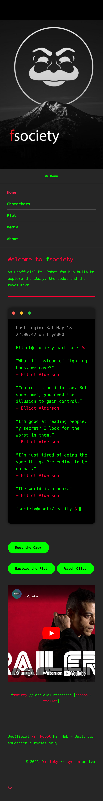

# Mr. Robot Fan Site — Terminal-Style Theme

A dedicated fan hub exploring characters, episodes, and iconic moments from *Mr. Robot*.  
Originally built on *WordPress* with custom styling and carefully structured information architecture (IA).  
This repository preserves the project (WordPress export, custom CSS, IA notes, screenshots) so reviewers can quickly understand the scope of work.

---

## 🔗 Live Site
👉 [Visit the Live Site](https://fsocietyfanhub.wordpress.com/)

---

## 🎯 Project Highlights
- Planned and implemented **information architecture** (menus, navigation flows, content groupings)  
- Created **custom CSS** for a terminal-style aesthetic, ensuring responsive layouts and accessible contrast  
- Integrated **media content** (trailers, behind-the-scenes) while maintaining usability  
- Migrated from **local development (MAMP)** to *WordPress.com* for reliable hosting and sharing  

---

## 🧭 Repository Structure
```text
mr-robot-fansite/
├─ export/                 # WordPress export ("All Content")
│  └─ wordpress-export.xml # exported 2025-08-29
├─ custom-css/             # Additional CSS from WordPress Customizer
│  └─ additional.css
├─ content/
│  ├─ SITE_MAP.md          # navigation + page structure
│  └─ COPY_DECK.md         # optional: main page copy
├─ screenshots/            # desktop & mobile screenshots
├─ theme/                  # optional: child theme files (style.css, functions.php, templates/)
├─ media/                  # optional: exported assets if available
├─ .gitignore
├─ LICENSE                 # MIT by default
└─ README.md
```

---

## 🖼️ Screenshots (Desktop)

  
  
  


## 📱 Screenshots (Mobile)

  
  
  
  
  


---

## 🛠️ How This Was Captured
- **Content export:** `Tools → Export → Export All Content` → saved in `export/wordpress-export.xml`  
- **Custom CSS:** copied from `Appearance → Customize → Additional CSS` into `custom-css/additional.css`  
- **Information architecture:** documented in `content/SITE_MAP.md`  
- **Screenshots:** desktop and mobile captures to show responsiveness and layout  

---

## 🔍 Tech & Practices
- **Platform:** WordPress (WordPress.com)  
- **Core:** HTML, CSS (custom), accessibility-first, responsive design  
- **Process:** IA planning → custom styling → content organization → deployment  
- **Tools:** WordPress Customizer, Browser DevTools, media optimization  

---

## 🚀 Future Enhancements
- Publish a lightweight **static HTML/CSS mirror** on GitHub Pages  
- Add a **React component** (e.g., character search/filter) to showcase modern JavaScript  
- Perform a **Lighthouse audit** and address performance, accessibility, and SEO opportunities  

---

## 📄 License & Disclaimer
- **License:** MIT (see [`LICENSE`](LICENSE))  
  - Alternatively, replace with “All Rights Reserved” for portfolio-only viewing permissions  
- **Disclaimer:** This is a non-commercial fan project for educational and portfolio purposes.  
  - *Mr. Robot* and related assets remain the property of their respective rights holders  

---

## 👋 Reviewer Notes
- Start with `/screenshots` for a quick overview of the UI  
- Review **`custom-css/additional.css`** to see the styling work  
- Check **`content/SITE_MAP.md`** for navigation and IA decisions  
- Use the **Live Site** link to experience the deployed version  

